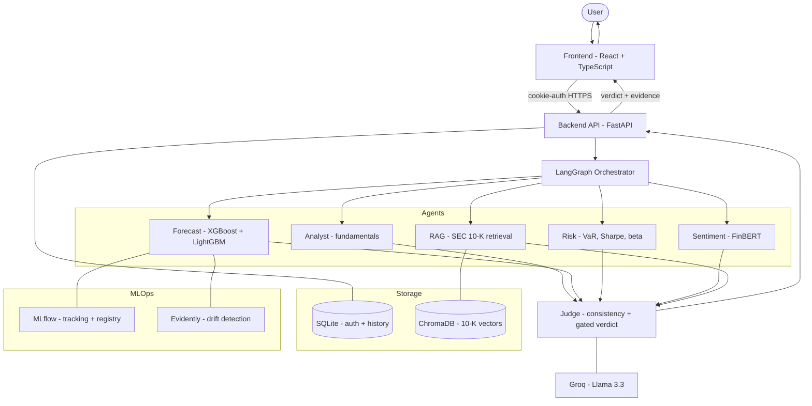
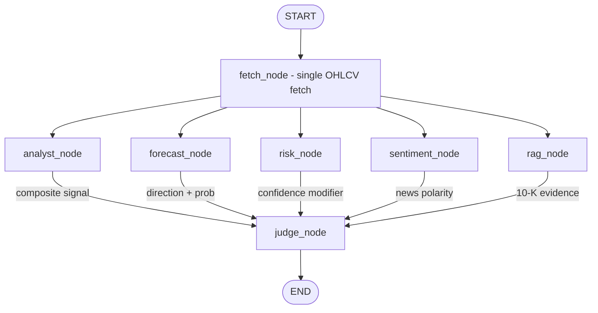
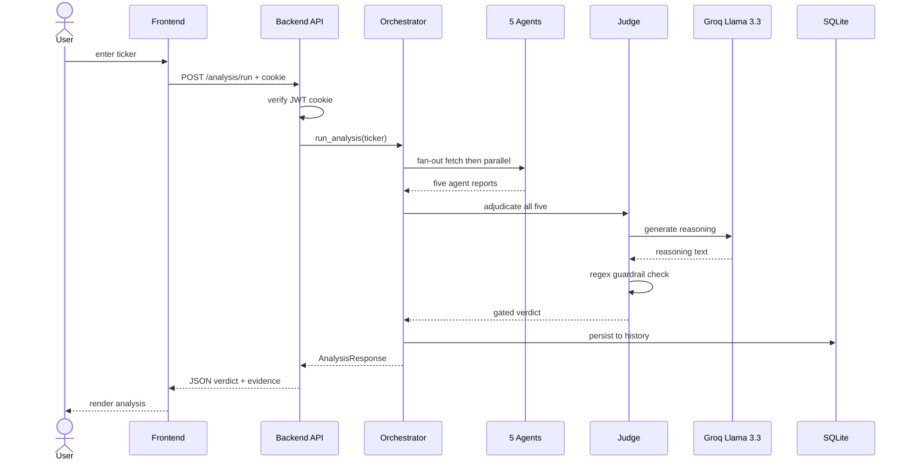

# FinSentinel Pro

**Five AI agents. One honest verdict.**


---

## Overview

FinSentinel Pro is a multi-agent equity-analysis platform. Five specialized agents —
**Analyst** (fundamentals), **Forecast** (an XGBoost + LightGBM ensemble), **Risk**
(VaR/Sharpe/beta), **Sentiment** (FinBERT over real news), and **Evidence/RAG**
(retrieval over real SEC 10-K filings) — run in parallel and feed a sixth **Judge**
agent. The Judge scores how consistently the five agents agree and issues a gated
verdict: **Approved**, **Conflicted**, or **Rejected**.

The differentiator is restraint. The Judge can refuse to approve **even when the
agents agree**, if confidence is genuinely low — any single risk flag blocks an
Approved verdict regardless of how high the consistency score is. And the Judge's own
LLM-written reasoning is **regex-validated** so it cannot overclaim accuracy or
confidence the system didn't actually earn.

Forecasts are validated, not hand-waved — **5-day AUC 0.52** (near coin-flip,
disclosed not hidden), **30-day AUC 0.61** (modest real signal). Every training run is
tracked in MLflow, and live feature drift is monitored with Evidently.

---

## High-Level Design



---

## Low-Level Design — the LangGraph orchestration

A single `fetch_node` pulls market data once, then fans out to the five agents in
parallel. The `judge_node` has an incoming edge from every agent and only runs after
all five complete.



The Judge then computes a weighted consistency score (analyst 0.6 + sentiment 0.4,
scaled down by a risk confidence factor), applies strict verdict gating, asks Groq
(Llama 3.3) for plain-English reasoning, and runs that text through a vocabulary +
"risk-boost" guardrail before returning.

---

## Sequence — one `/analysis/run` request



---

## Tech Stack

| Layer | Technology |
|---|---|
| **Backend** | FastAPI, LangGraph, Groq (Llama 3.3 — `llama-3.3-70b-versatile`), Pydantic v2, Uvicorn |
| **ML** | XGBoost, LightGBM, SHAP, FinBERT (`ProsusAI/finbert`), scikit-learn, pandas-ta |
| **MLOps** | MLflow (tracking + model registry), Evidently AI (data drift) |
| **Data / RAG** | yfinance, SEC EDGAR (10-K filings), NewsAPI, ChromaDB, sentence-transformers (`all-mpnet-base-v2`), ftfy |
| **Auth / DB** | SQLAlchemy, SQLite, PyJWT, passlib + bcrypt |
| **Frontend** | React 18, TypeScript, Vite, Tailwind CSS, Framer Motion, React Router |

---

## Project Structure

```text
FinSentinel-pro/
├── backend/
│   ├── main.py                  # FastAPI app: CORS, router wiring, startup guards
│   ├── schemas.py               # Pydantic v2 models (agent outputs + AnalysisResponse)
│   ├── database.py              # SQLAlchemy engine/session (SQLite, Postgres-ready)
│   ├── db_models.py             # User + AnalysisHistory ORM models
│   ├── agents/
│   │   ├── orchestrator.py      # LangGraph state graph (fan-out → judge)
│   │   ├── analyst_agent.py     # Fundamentals + technical snapshot
│   │   ├── forecast_agent.py    # XGBoost + LightGBM ensemble caller
│   │   ├── risk_agent.py        # VaR, CVaR, Sharpe, Sortino, drawdown, beta
│   │   ├── sentiment_agent.py   # FinBERT over NewsAPI headlines
│   │   └── judge_agent.py       # Consistency scoring + gated verdict + LLM reasoning
│   ├── ml/
│   │   ├── features/            # technical.py, fundamental.py
│   │   ├── models/forecaster.py # Stacked ensemble + MLflow registry loader
│   │   └── explainability/shap_explainer.py
│   ├── mlops/
│   │   ├── registry.py          # MLflow config + staging/production aliases
│   │   ├── drift_detector.py    # Evidently drift report
│   │   └── inference_log.py     # SQLite feature logging for drift
│   ├── auth/                    # security.py, dependencies.py, router.py, schemas.py
│   ├── data/market_data.py      # yfinance access
│   ├── routers/                 # analysis.py, history.py, mlops.py
│   └── requirements.txt
├── rag/
│   ├── ingestion/               # sec_loader.py (SEC EDGAR), chunker.py
│   ├── vectorstore/chroma_store.py
│   └── retriever.py             # top-k retrieval + confidence tiers
├── scripts/
│   ├── train_models.py          # Pooled training + MLflow logging + registry
│   └── promote_model.py         # Staging → Production alias
├── frontend/
│   └── src/
│       ├── pages/               # Landing, Auth, Dashboard, Analysis, History, Settings
│       └── components/ui/       # EvidenceCard, VerdictStamp, MarginNote, AppHeader, …
├── .env.example
└── README.md
```

---

## Getting Started

### Prerequisites
- Python 3.13, Node 18+
- A [Groq API key](https://console.groq.com/keys) (Judge reasoning — optional; falls back to deterministic text if absent)
- A [NewsAPI key](https://newsapi.org/register) (Sentiment agent — optional; falls back to neutral if absent)

### Backend

```bash
# from the project root
python -m venv venv
source venv/Scripts/activate          # Windows (Git Bash); use venv\Scripts\activate on PowerShell

pip install -r backend/requirements.txt

cp .env.example .env                   # then fill in JWT_SECRET_KEY, GROQ_API_KEY, NEWSAPI_KEY
# generate a real secret: python -c "import secrets; print(secrets.token_hex(32))"

# (optional but recommended) train + register the forecaster.
# Without this, the forecaster falls back to per-request fitting.
python scripts/train_models.py
python scripts/promote_model.py --yes

# run the API on :8000 (the frontend expects this host)
python -m uvicorn backend.main:app --host 127.0.0.1 --port 8000
```

### Frontend

```bash
cd frontend
npm install

# run on :5180 — the backend's default CORS policy allows this origin
npm run dev -- --port 5180
```

Open **http://localhost:5180**.

> Tables are created automatically on first backend start (SQLite at
> `backend/finsentinel.db`). To allow a different frontend origin, set
> `CORS_ORIGINS` in `.env`.

---

## API Reference

All `/analysis`, `/history`, and `/mlops` routes require authentication via the
httpOnly session cookie set on login/signup.

| Method | Endpoint | Description |
|---|---|---|
| `POST` | `/auth/signup` | Create an account; sets the JWT session cookie |
| `POST` | `/auth/login` | Authenticate; sets the JWT session cookie |
| `POST` | `/auth/logout` | Clear the session cookie |
| `GET`  | `/auth/me` | Current authenticated user |
| `POST` | `/analysis/run` | Run the 5-agent + Judge pipeline for a ticker; persists to history |
| `GET`  | `/history` | List the current user's past analyses (`limit` query param) |
| `GET`  | `/history/{history_id}` | Fetch one saved analysis in full |
| `GET`  | `/mlops/drift-report` | Feature-drift check of recent inferences vs the training baseline |
| `GET`  | `/health` | Liveness probe |

---

## Known Limitations

This is an honest accounting, not a wishlist:

- **SQLite, not Postgres.** Used for zero-ops local development. The SQLAlchemy models
  are database-agnostic, so production can swap to Postgres by changing `DATABASE_URL`
  with no schema changes.
- **No Docker containerization yet.** The app runs directly via `uvicorn` / `npm run dev`.
- **Partial test coverage.** A `pytest` suite covers the Judge's pure logic
  (consistency scoring, verdict gating, risk factor, LLM guardrails), the
  forecaster's direction/confidence-interval mapping, and the auth + history
  endpoints (via a TestClient on a throwaway SQLite DB). The full multi-agent
  pipeline and live integrations (Groq, yfinance, SEC, NewsAPI) are still
  verified manually/end-to-end rather than in CI.
- **Single-machine deployment only.** Not yet hosted; backend and frontend run locally.
- **Forecaster is intentionally modest.** Short-horizon equity direction is near
  random; the system discloses this (5-day AUC ~0.52) rather than inflating it.

---

## Author

Built by **Sadhuram Agarwal**.

- GitHub: [github.com/sadhuram09](https://github.com/sadhuram09)
- Portfolio: [portfolio-sand-delta-64.vercel.app](https://portfolio-sand-delta-64.vercel.app/)
